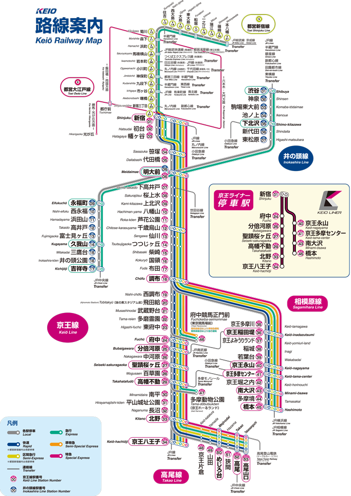
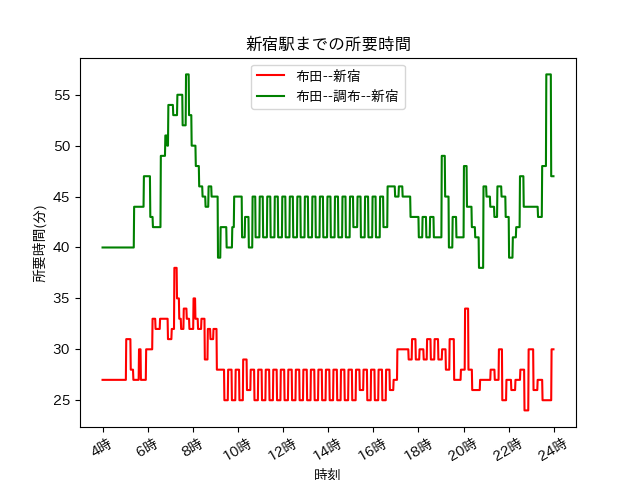

# Fuda-Shinjuku-calculator
まずは京王線の路線図をご覧ください.
 
ご覧の通り, 京王線は特急, 準特急, 各停など色々な速さの電車があり, 
駅によってどの速さのものが停まるか決まっています.
例えば, 調布駅であれば全て電車が停まるので, 特急か準特急に乗れば20分以内で新宿に着くことができます.
しかし, 布田駅のように目的地(新宿)と特急が停まる駅(調布駅)の間にあって, さらに特急が停まる駅(調布駅)の「一つ」だけ隣にある駅は
そのまま各停や区間急行などを乗り継いで新宿に向かったほうが良いのでしょうか？
それとも一旦調布駅に戻ってから特急で新宿に向かった方が良いのでしょうか？

### データ分析の動機
なぜこのような疑問を抱いたのかというと, 2つの要素が絡み合っているからだと思います.
それは「特急の駅に挟まれている」と「1つ隣の駅」という要素が同時に成り立っているからだと思います.
もしどちらかの要素だけであれば, 「調布に戻った方がよいのかな〜」という疑問は無かったと思います.
「特急の駅に挟まれている」だけの場合, 例えば国領駅が最寄り駅の場合, 調布駅まで戻ろうという気持ちにはならなかったと思います.
2駅戻るのと1駅もどるというのはそれほど精神的な差があると思います.
「1つ隣の駅」だけが問題の場合, 例えば西調布駅が最寄り駅ならば, 選択の余地がなく調布駅に一旦各停で向かうことになります.

### データ分析の結果
yahoo路線検索から, 4-24時の各時刻(1分刻み)において, 最短時間ルートを検索しました.
 
図示すると, すべての時刻において戻るよりそのまま新宿へ向かったほうが早いという結果になりました.
ただし, 最短時間ルートは, 各停, 区間急, 準特急or特急の乗換によるものであり乗換が多いです.
また, 特に込んでいる時間では座席や立ち位置などポジション確保に不利となります.

### さらなる検証
おそらくですが, 小田急のように快速と快速以外に差が大きいものはこの京王線布田駅と違い快速の停まる駅に戻った方がよいと考えられます.
そこで百合ケ丘駅における同様の実験をしてみました.
